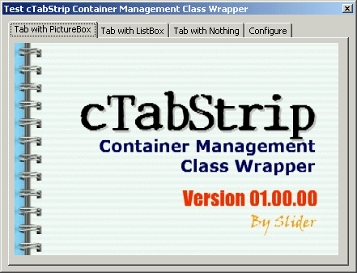



## cTabStrip 'Container Management' Class wrapper

### Description

The wrapper is designed to take control of all associated containers/controls in three easy steps:- 1. Hook a TabStrip control; 2. assign controls to tabs; & 3. set how the controls will be managed - the wrapper will do the rest! Other features include container management, automatic positioning (center, top-left, bottom right, etc...) and auto-Fit.

The wrapper makes use of object pointers (weak object references) to aviod circular references. All code is cleanly formatted and well commented.

The included program demonstrates how easy the wrapper class is to use - Take note of the placement of the different types of associated controls and how the wrapper fixes up their containers, visibility and positioning on start-up. If you use the TabStrip control or have wanted to, then this is for you!
 
### More Info
 

             |
---                |---
**Submitted On**   |2002-08-01 21:38:06
**By**             |[Slider](https://github.com/Planet-Source-Code/PSCIndex/blob/master/ByAuthor/slider.md)
**Level**          |Intermediate
**User Rating**    |4.9 (102 globes from 21 users)
**Compatibility**  |VB 6\.0
**Category**       |[VB function enhancement](https://github.com/Planet-Source-Code/PSCIndex/blob/master/ByCategory/vb-function-enhancement__1-25.md)
**World**          |[Visual Basic](https://github.com/Planet-Source-Code/PSCIndex/blob/master/ByWorld/visual-basic.md)
**Archive File**   |[cTabStrip\_113192812002\.zip](https://github.com/Planet-Source-Code/slider-ctabstrip-container-management-class-wrapper__1-37475/archive/master.zip)

